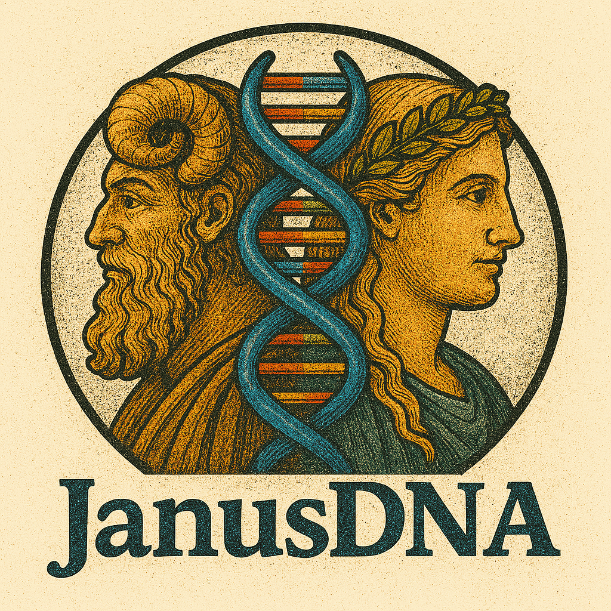

<p align="center">
  
</p>

# JanusDNA: A Powerful Bi-directional Hybrid DNA Foundation Model

## Update
<a name="update"></a>

- **2025-06-28**: Pretrained JanusDNA weights are now available for download [here](https://dataverse.harvard.edu/dataset.xhtml?persistentId=doi%3A10.7910%2FDVN%2FHDT0RN&version=DRAFT).


## Getting Started
<a name="getting_started"></a>

To begin, create a conda environment with the required dependencies:

```bash
conda env create -f janusdna.yml
```

Activate the environment:

```bash
conda activate janusdna
```

Install Mamba:

```bash
wget https://github.com/state-spaces/mamba/releases/download/v2.2.4/mamba_ssm-2.2.4+cu12torch2.5cxx11abiFALSE-cp311-cp311-linux_x86_64.whl
pip install mamba_ssm-2.2.4+cu12torch2.5cxx11abiFALSE-cp311-cp311-linux_x86_64.whl

pip install selene-sdk --no-deps
```

## Reproducing Experiments
As described in the paper, there are four main experimental components:
1. Pretraining JanusDNA on the Human Reference Genome
2. GenomicBenchmarks
3. Nucleotide Transformer Datasets
4. DNALongBench

### Pretraining on the Human Reference Genome
(Data downloading instructions adapted from the [HyenaDNA](https://github.com/HazyResearch/hyena-dna?tab=readme-ov-file#pretraining-on-human-reference-genome))

First, download the Human Reference Genome data, which consists of two files: a `.fasta` file containing all sequences, and a `.bed` file specifying the intervals used.

The directory structure should be:

```
data
|-- hg38/
  |-- hg38.ml.fa
  |-- human-sequences.bed
```

Download the fasta (.fa) file for the entire human genome into `./data/hg38`. The genome contains approximately 24 chromosomes, merged into a single file. Then, download the .bed file with sequence intervals (chromosome name, start, end, split), which allows retrieval from the fasta file.

```bash
mkdir -p data/hg38/
curl https://storage.googleapis.com/basenji_barnyard2/hg38.ml.fa.gz > data/hg38/hg38.ml.fa.gz
gunzip data/hg38/hg38.ml.fa.gz  # unzip the fasta file
curl https://storage.googleapis.com/basenji_barnyard2/sequences_human.bed > data/hg38/human-sequences.bed
```

Run a pre-training script from [`scripts/pre_train/`](./scripts/pre_train):

```
|-- scripts
  |--pre_train
    |-- slurm_JanusDNA_w_midattn_32dim.sh
    |-- slurm_JanusDNA_w_midattn_72dim.sh
    |-- slurm_JanusDNA_wo_midattn_32dim.sh
    |-- slurm_JanusDNA_wo_midattn_72dim.sh
    |-- slurm_JanusDNA_wo_midattn_144dim.sh
```

For example:

```bash
cd scripts/pre_train/
sbatch slurm_JanusDNA_w_midattn_32dim.sh
```

### GenomicBenchmarks
<a name="genomicbenchmarks"></a>

The [GenomicBenchmarks](https://github.com/ML-Bioinfo-CEITEC/genomic_benchmarks) suite, as presented in [Grešová et al. (2023)](https://bmcgenomdata.biomedcentral.com/articles/10.1186/s12863-023-01123-8), comprises eight classification tasks.

You can launch fine-tuning with 5-fold cross-validation using [`gb_janusdna.sh`](./scripts/benchmark/gb/gb_janusdna.sh):

```bash
bash scripts/benchmark/gb/gb_janusdna.sh
```

### Nucleotide Transformer Datasets
<a name="nucleotidetransformer"></a>

The Nucleotide Transformer suite of tasks was introduced in [Dalla-Torre et al. (2023)](https://www.biorxiv.org/content/10.1101/2023.01.11.523679v1). The data is available on HuggingFace: [InstaDeepAI/nucleotide_transformer_downstream_tasks](https://huggingface.co/datasets/InstaDeepAI/nucleotide_transformer_downstream_tasks).

You can launch fine-tuning with 10-fold cross-validation using [`nt_janusdna.sh`](./scripts/benchmark/nt/nt_janusdna.sh):

```bash
bash scripts/benchmark/nt/nt_janusdna.sh
```

### DNALongBench
Download the dataset from the [dataset website](https://dataverse.harvard.edu/privateurl.xhtml?token=93d446a5-9c75-44bf-be1c-7622563c48d0) following the instructions in the [DNALongBench repository](https://github.com/wenduocheng/DNALongBench?tab=readme-ov-file).

Place the eQTL dataset zip file in the [`data`](./data) directory and unzip it:

```bash
mkdir -p <root of project dir>/data/dnalongbench
mv <the downloaded zip file> <root of project dir>/data/dnalongbench
unzip <root of project dir>/data/<the downloaded zip file>

cd data/dnalongbench/eQTL/seqs
gunzip hg38.fa.gz
```

You can fine-tune on a specific cell-type dataset using [`eqtl_train_janus_8gpu.sh`](./scripts/benchmark/dnalong/eqtl_train_janus_8gpu.sh):

```bash
sbatch scripts/benchmark/dnalong/eqtl_train_janus_8gpu.sh
```

After fine-tuning, evaluate the results on the corresponding test dataset using [`eqtl_evaluation_janus.sh`](./scripts/benchmark/dnalong/eqtl_evaluation_janus.sh):

```bash
sbatch scripts/benchmark/dnalong/eqtl_evaluation_janus.sh
```

Evaluation output and all log files for fine-tuning and evaluation will be stored in the `watch_folder` directory. For example:

```
watch_folder
|-- eQTL
  |-- janusdna_len-131k_d_model-144_inter_dim-576_n_layer-8_lr-8e-3_step-50K_moeloss-true_1head_onlymoe
    |-- Whole_Blood_lr-4e-4_cjtrain_false_batch_8_seed_1.log                    
      (fine-tuning log)
    |-- Whole_Blood_lr-4e-4_cjtrain_false_batch_8_seed_1_cjtest_true.log        
      (evaluation log)
    |-- Whole_Blood_lr-4e-4_cjtrain_false_batch_4_seed_1_cjtest_true_output.txt
      (evaluation output)
```

To calculate AUROC based on the evaluation output, use the script [`auroc.py`](./evals/auroc.py).

A script is also provided to calculate AUROC for all cell-type datasets at once, [`evaluate_auroc_janus.py`](./evals/evaluate_auroc_janus.py).


# Acknowledgements
This repository is adopted from the [Caduceus](https://github.com/kuleshov-group/caduceus) and leverages much of the training, data loading, and logging infrastructure defined there. Caduceus was originally derived from the [HyenaDNA](https://github.com/HazyResearch/hyena-dna).
We also acknowledge the contributions of [`Jamba-v0.1`](https://huggingface.co/ai21labs/Jamba-v0.1/tree/main), which provided the initial codebase for hybrid architectures.
